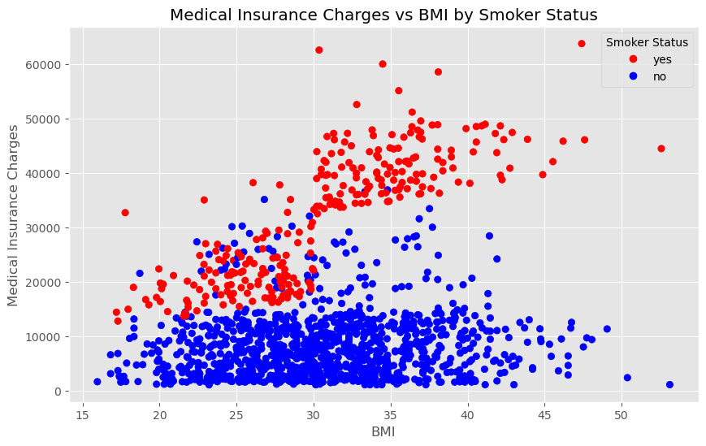
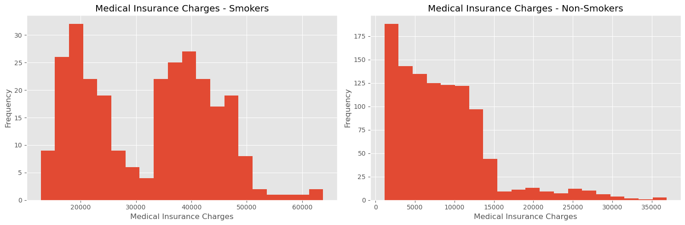
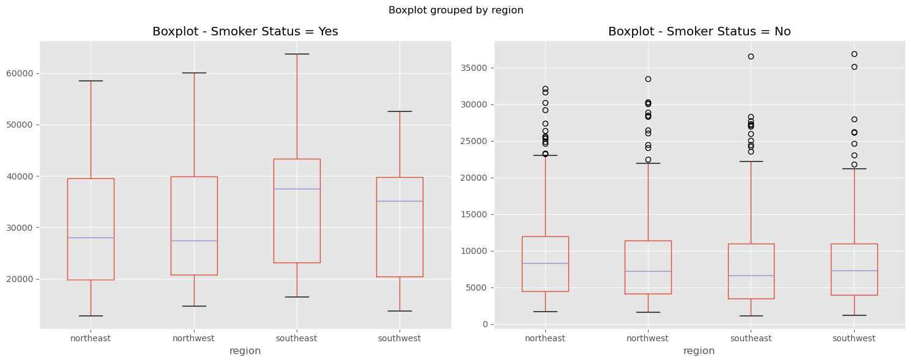
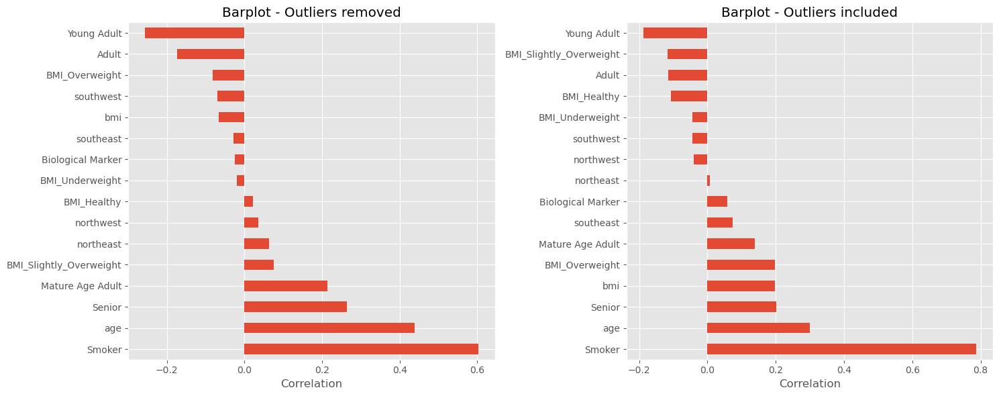

# FamInsureCo Medical Insurance Cost Analysis

## Project Overview

This project uses Python, pandas, and Matplotlib to explore factors associated with medical insurance charges.

The analysis examines BMI, smoking status, region, sex, high-cost outliers, and feature correlations to identify patterns in insurance costs and understand how extreme observations influence statistical relationships.

The project was completed in Jupyter Notebook and organized as a reproducible exploratory analysis with visualizations and written interpretation.

## Project Objective

Identify which available characteristics show the strongest relationships with medical insurance charges and evaluate how high-cost observations affect those relationships.

## Business Questions

This project explores several questions:

- How are BMI and medical insurance charges related?
- Does smoking status change the relationship between BMI and insurance charges?
- How do charge distributions differ between smokers and non-smokers?
- Do region or sex show meaningful differences once smoking status is considered?
- How many high-cost outliers are identified using the IQR method?
- Which variables are most strongly correlated with medical insurance charges?
- How do those correlations change after high-cost outliers are removed?

## Tools Used

- Python
- Jupyter Notebook
- pandas
- Matplotlib
- Data cleaning and filtering
- Grouped aggregations
- Descriptive statistics
- Data visualization
- IQR-based outlier detection
- Correlation analysis

## Analysis

### BMI and Insurance Charges

Examined the relationship between BMI and medical insurance charges at both the individual and grouped BMI-classification level.

BMI showed considerable variation in insurance charges, suggesting that BMI alone does not fully explain differences in cost.

### Smoking Status

Segmented the data by smoking status to determine whether smoking helps explain the wide variation observed in insurance charges.

Smoking status produced a substantially clearer separation in charges than BMI alone.

### Regional and Sex-Based Comparisons

Compared insurance-charge distributions across region and sex while separating smokers from non-smokers.

These comparisons showed some distributional differences, but smoking status remained the more prominent pattern.

### Outlier Analysis

Applied the interquartile range method to identify unusually high medical insurance charges.

The analysis identified **139 high-cost observations**, with approximately **89.6% of the dataset remaining** after those observations were removed.

Rather than automatically treating the high-cost cases as errors, the analysis compared results with and without them to understand their influence.

### Correlation Analysis

Measured correlations between encoded numeric features and medical insurance charges.

Smoking status had the strongest positive correlation with charges at approximately **0.79**, followed by age at approximately **0.30** and BMI at approximately **0.20**.

### Outlier Sensitivity

Compared feature correlations before and after removing IQR-defined high-cost observations.

Smoking status remained the strongest positive correlate after outlier removal, although its relationship weakened. Age and Senior status became relatively more prominent, while the relationship between BMI and charges weakened.

## Project Highlights

### Smoking Status Revealed a Clear Cost Pattern

Separating observations by smoking status revealed a much stronger pattern than examining BMI alone. Higher insurance charges were heavily concentrated among smokers.

### Charge Distributions Differed Substantially by Smoking Status

Smokers showed substantially more high-cost observations, while non-smokers were concentrated at lower insurance-charge levels.

### Smoking Remained Prominent Across Regional Comparisons

Regional box plots showed variation in medical insurance charges, but the difference between smokers and non-smokers remained more pronounced than the regional differences themselves.

### Outliers Influenced Statistical Relationships

Comparing correlations before and after removing high-cost observations showed that extreme values can materially affect the apparent strength of relationships between variables and insurance charges.

## Key Findings

- BMI alone does not fully explain variation in medical insurance charges.
- Smoking status provides the clearest separation in insurance charges across the visual analysis.
- Smoking status has the strongest positive correlation with medical insurance charges at approximately **0.79**.
- Age shows a weaker positive correlation of approximately **0.30**, while BMI is approximately **0.20**.
- The IQR method identifies **139 high-cost observations**.
- Approximately **89.6% of the dataset remains** after removing those high-cost observations.
- Feature correlations change after outlier removal, demonstrating the importance of evaluating how extreme observations influence statistical results.
- Region and sex show some distributional differences, but smoking status remains the more prominent pattern in this analysis.

## Limitations

This project is an exploratory analysis of the available dataset and identifies associations rather than causal relationships.

Correlation does not establish that a variable directly causes higher medical insurance charges. High-cost observations may also represent legitimate insurance experiences rather than incorrect data, which is why the analysis evaluates their influence instead of assuming they should always be discarded.

Additional modeling and domain context would be required to estimate predictive or causal effects.

## Jupyter Notebook

[View the complete Python analysis](notebook/faminsureco-analysis.ipynb)

The notebook contains the full analytical workflow, including data loading, pandas transformations, grouped analysis, visualizations, IQR-based outlier detection, correlation analysis, and written interpretation.

## Skills Demonstrated

- Python programming
- pandas data manipulation
- Exploratory data analysis
- Data visualization with Matplotlib
- Grouped aggregation
- Descriptive statistics
- Outlier detection
- Correlation analysis
- Comparative analysis
- Statistical interpretation
- Communicating analytical findings

## Project Files

- **Jupyter Notebook:** [`notebook/faminsureco-analysis.ipynb`](notebook/faminsureco-analysis.ipynb)  
  Contains the complete reproducible Python analysis and interpretation.

- **Project Visuals:** `images/`  
  Contains selected visualizations highlighting the primary findings of the analysis.

## About This Project

This project was completed as part of my Data Analytics Career Program coursework and was adapted into a portfolio-ready analysis to highlight my Python, pandas, visualization, statistical analysis, and analytical communication skills.
